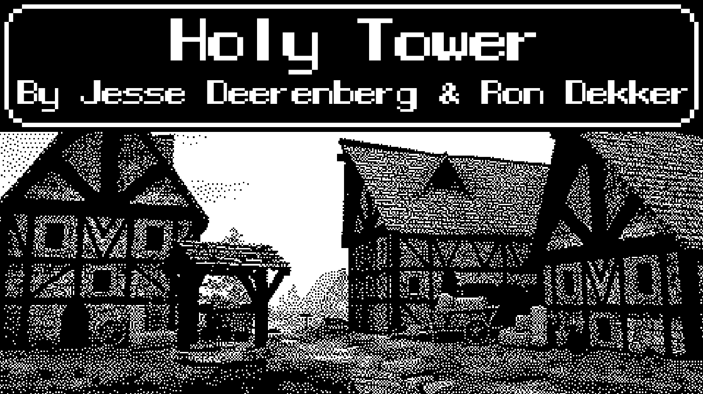
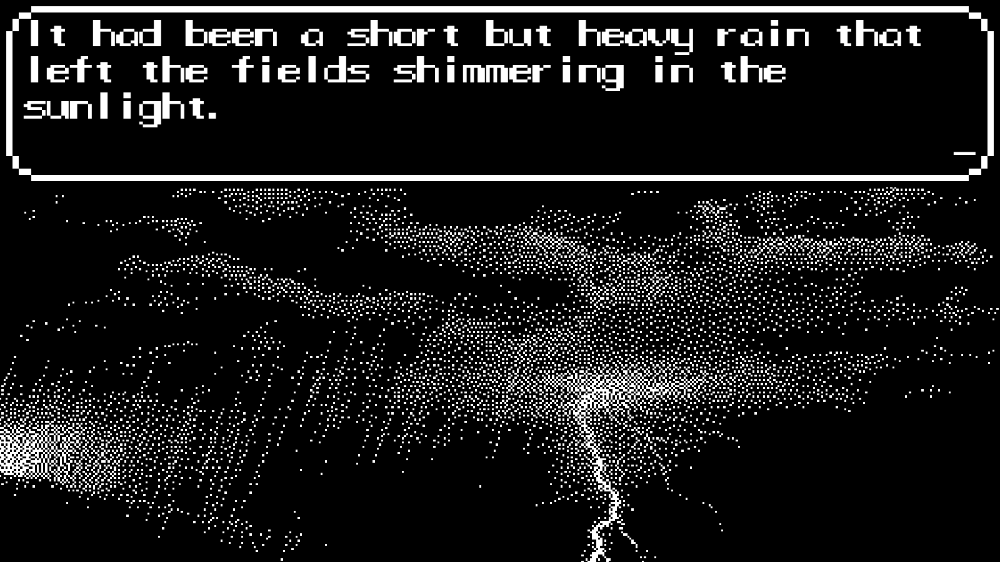

# Holy Tower
## Global Game Jam 2016

The following project was made during the Global Game Jam of 2016 by [Jesse Deerenberg](https://www.linkedin.com/in/jesse-deerenberg-b324113b/) and [I](https://www.rondekker.nl).

What we created is a semi-text based game, in which the player is a wise man, priest-like figure. The player’s job is to help him and the village to survive by bringing offerings to the god-like guardians. The villagers will come to the player to ask his help with the issues that they face, be it floods, broken bridges, plagues, storms or whatnot.The player has a free choice of which of the three gods to bring an offer to, and also what that offer is. This creates a sense of agency as their choices actively influence and change the game world. The game was made using only two “Colours”: Black and White, is playable with a SNES to usb controller and runs on Windows (Keyboard can also be used instead of the controller, using wasd or arrow keys and z/x for accepting or returning).

[Global Game Jam page](https://globalgamejam.org/2016/games/holy-tower)
Unity version 5.3.2f1

